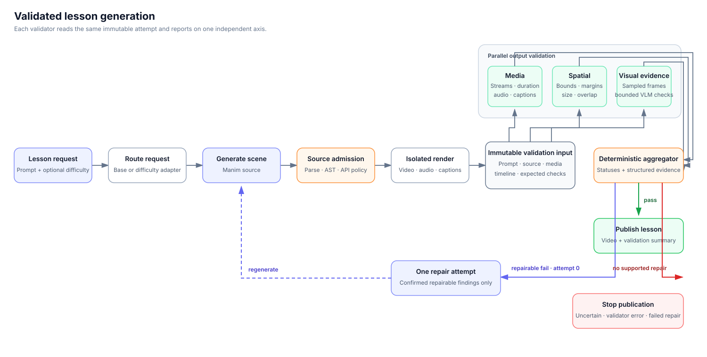

# Math Tutor

Math Tutor is a simple agentic application that turns a math prompt into an animated lesson with optional narration synchronized to the video.


## Demo

[](https://www.loom.com/share/9a158cbb6ad14d0da5550907970b0aab)

## How it works

Math Tutor turns a question into a Manim scene and renders it as an animated lesson.
The generation model was LoRA fine-tuned on
[Bespoke-Manim](https://huggingface.co/datasets/bespokelabs/bespoke-manim), a dataset
of prompts paired with animation plans, narration, and Manim code. The project also
contains foundational, intermediate, and advanced adapters for studying difficulty-based
routing. Requests can use an explicit difficulty or the application's routing heuristic.

Generated source must pass deterministic admission checks before it can run in an
isolated renderer. A successful render produces one immutable validation input containing
the prompt, admitted source, video, optional audio and captions, spatial timeline, and the
checks expected for that attempt.

Three output validators then run in parallel. The media validator checks the files and
audio/video metadata. The spatial validator evaluates the renderer's object-bound traces
for cropping, unsafe margins, oversized objects, and persistent intersections. The visual
validator samples a small set of frames and asks a separately hosted vision model for
bounded, frame-specific findings such as visible truncation, missing requested visuals,
rendering corruption, caption mismatch, or severe clutter.

A deterministic aggregator combines those reports in this order: validator error,
uncertain, confirmed failure, then pass. A passing attempt is published. A confirmed
repairable failure can return structured feedback to the generator once; the repaired
video must pass the same checks. Uncertain results and validator failures stop publication
because they do not provide enough evidence for a safe repair. Lesson length remains an
advisory measurement rather than a hard generation requirement.




## Setup

### Prerequisites

- An existing Modal inference endpoint and its authentication token
- Optional: an ElevenLabs API key for narration and captions

### Configuration

```bash
git clone https://github.com/splion-360/math-tutor.git
cd math-tutor
make setup
```

Edit `backend/.env` to configure lesson generation:

| Variable | Used for |
| --- | --- |
| `MODAL_VLLM_BASE_URL` | An existing Modal inference endpoint, including `/v1`; selects the three-adapter serving path |
| `MODAL_VLLM_API_KEY` | Authentication with that endpoint |
| `MODAL_VISUAL_MODEL_BASE_URL` | An existing Modal vision endpoint, including `/v1`, used for sampled-frame checks |
| `MODAL_VISUAL_MODEL_API_KEY` | Authentication with the vision endpoint |
| `ELEVENLABS_API_KEY` | Optional narration and captions |

The service stops publication when the visual endpoint is not configured or cannot
complete its check. This produces a `validator_error`; it does not consume the repair attempt.

### Run

```bash
docker compose up --build
```

Compose prepares the rendering images and starts the backend and frontend.
Python, Node.js, and FFmpeg are included in the containers.

Stop the app with `docker compose down`. Generated files are saved in
`backend/artifacts/` and excluded from Git.

## Project structure

```text
math-tutor/
├── frontend/           # Lesson interface and video player
├── backend/            # Lesson generation, rendering, and evaluation
├── training/           # LoRA training, gradient probes, and configurations
├── deployments/modal/  # Remote training and serving
├── docker-compose.yaml # Local application services
└── Makefile            # Setup and development commands
```
